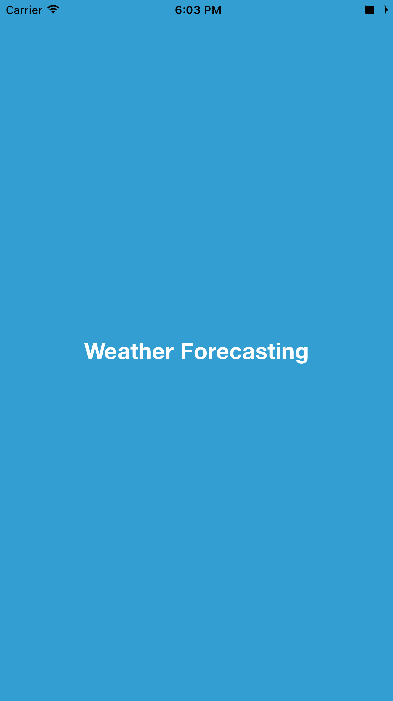
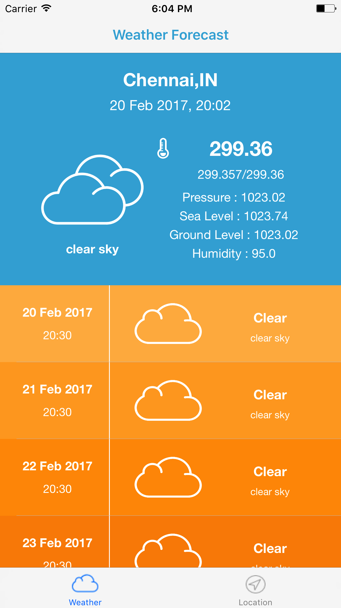
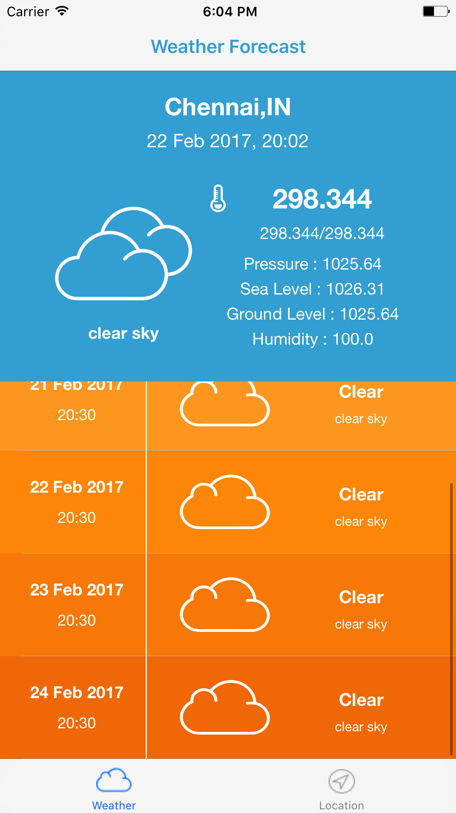
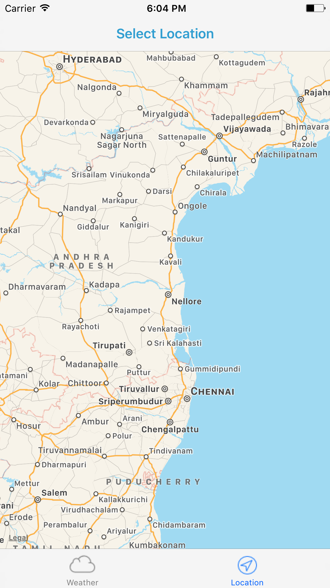

# WeatherForecast
An simple iOS application for weather forecasting

Built using 

1. Xcode 8.2.1
2. Swift 3.0

No external libraries used.

Steps to follow:

1. Run the app in above said configurations.
2. Default location selected in chennai.
3. Click on table view items to load weather details for each day.

Highligthts:

1. This project is built on the coding standards provided by apple.
2. This uses (NSOperation + NSOperationQueue)API provided by apple with enhanced functionalities proposed by apple in WWDC 2015.
3. Built on latest version of swift 3.0 and xcode 8.2.1

Screenshots

